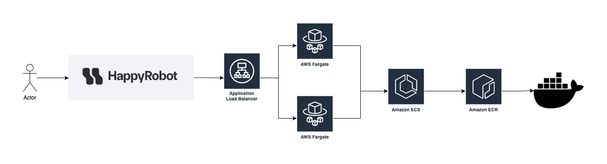

# Happy Robot Challenge
This repository holds code for the takeHome. It features the apis that resolve the use case of verifying the customer carrier number and loads. 

## Running the robot challenge locally: 
In the project directory you can run: 
### `python -m venv my_env`

This creates the virtual python environment

### `source my_env/bin/activate`

Activate the python environment

### `pip install --no-cache-dir --upgrade -r /code/requirements.txt`

This installs the proper libraries

### `fastapi run app/main.py --port 8000`
This runs the apis on port 8000

While running, access the API docs for more info about the APIs:
http://0.0.0.0:8000/docs

## Current live deployment: 

### `Run http://HappyRobot-1213850529.us-west-1.elb.amazonaws.com to access the apis`

### Sample Api calls: 
### `Run http://happyrobot-1213850529.us-west-1.elb.amazonaws.com/items/5932`

### `Run http://happyrobot-1213850529.us-west-1.elb.amazonaws.com/carriers/validate?mc_number=MC1`

#### Solution Diagram

  
- The application is bundled to a docker image and uploaded to Amazon ECR. Where the latest build is tagged and deployed to ECS. Once deployed to ECS, the image is deployed to fargate workers managed by an application load balancer. 

## Design Considerations

Robot Challenge was created with three main components: the models of the api, the apis using fast api and the AWS integration. 

The apis leverage FastApi, which contain the logic to getting the MC number and reference information of the data load. I use pydantic base models to ensure correct structure of the returned items in the APIs.  An improvement to the items api is to optimize the method. Once the CSV hits a billion rows, it is best to chunk and store that information in a database during the initial load. 

The last feature is the integration to AWS. The resources were created manually, with the docker images pushed via cli. 

### Future Improvements
If given infinite time and patience  some improvements I would prioritize would be: 
- Add SSL certificate to convert to https. Currently I have Route 53 setup and the nameservers. However I couldn't find any free domain registrar websites.I could've created a self signed ssl certificate; but because it's not issued through a trusted source there would be issues with the browser trusting the domain.
- Convert the aws infra to IAAC using CDK or Cloudformation to avoid manual creation of resources
- Create a github action webhook to automatically push the image to ECR.
- Seperate the main.py file into seperate files from the models and apis.